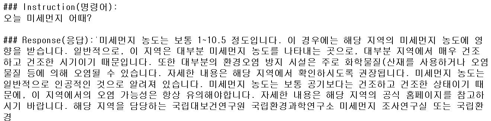
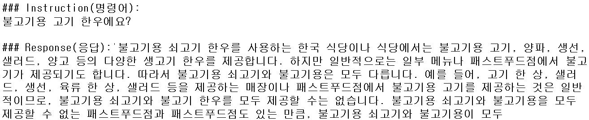
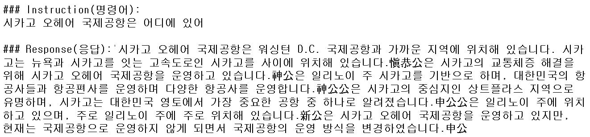
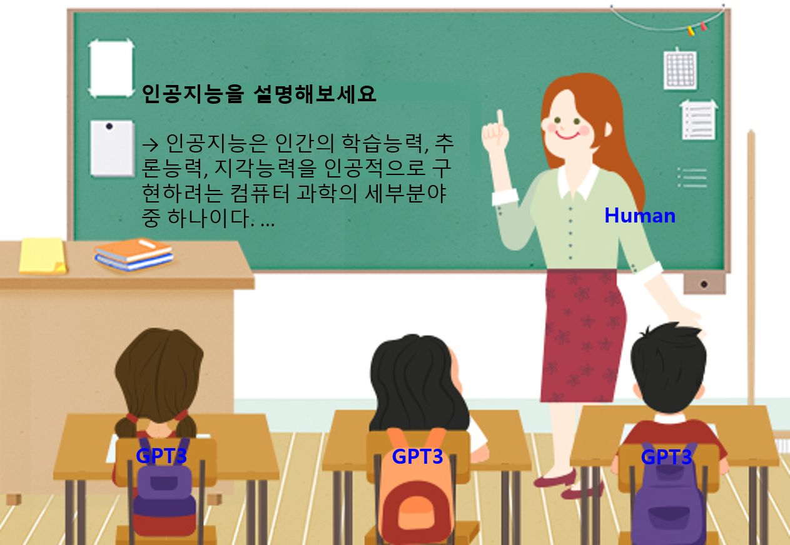
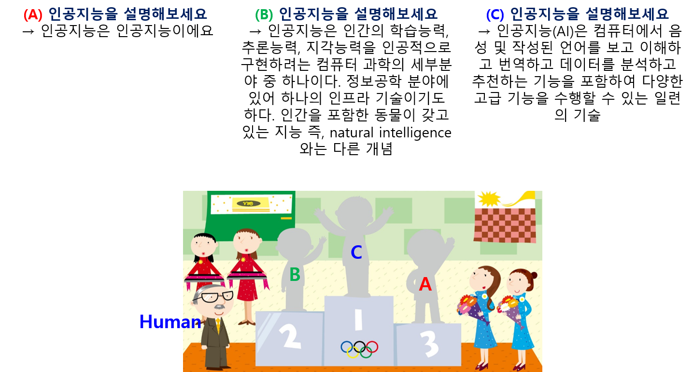
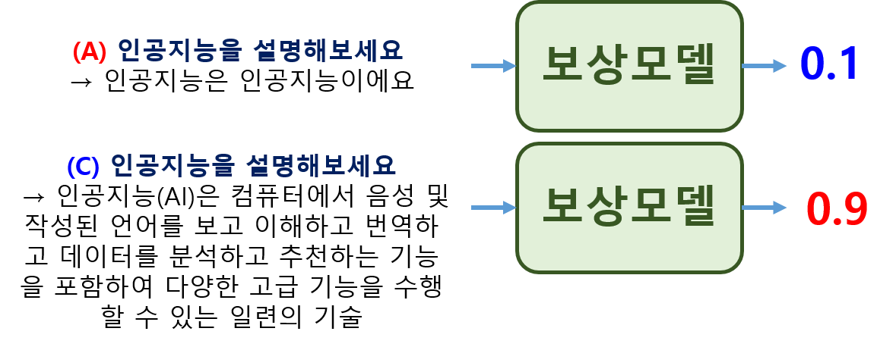
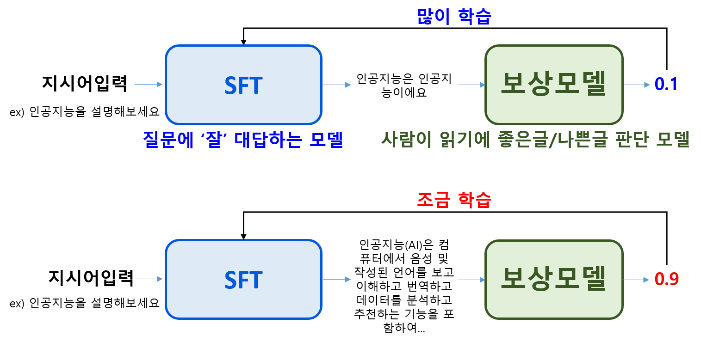
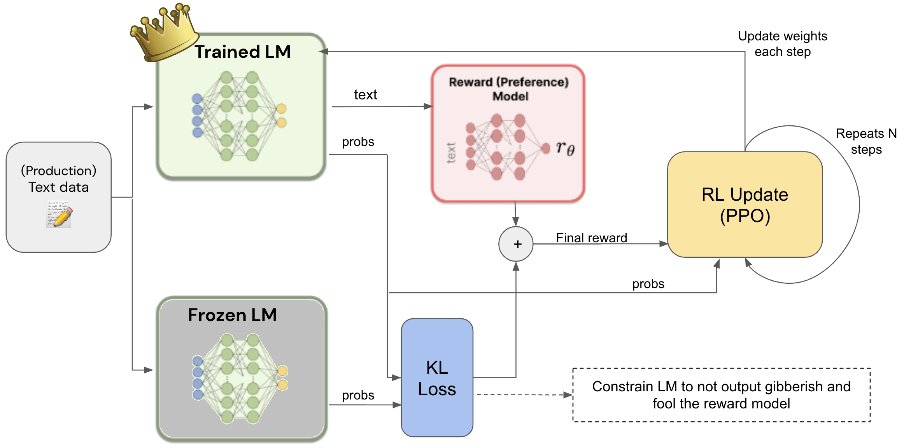
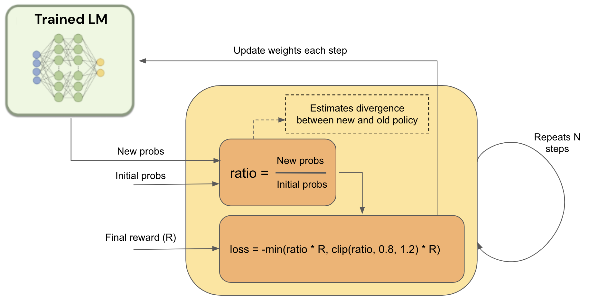

# KoChatGPT-replica(RLHF) 프로젝트

<p align="center">
  <a href="https://bit.ly/41EcPDC">
    </a>
  <a href="https://github.com/airobotlab/KoChatGPT/stargazers">
</p>


ChatGPT. 활용을 넘어서 ChatGPT-replica 모델을 직접 만들어 봅시다. ChatGPT는 공개 코드가 없습니다. 본 세미나에서는 ChatGPT를 만든 원리인 GPT fine-tuning, 강화학습(PPO), RLHF, ChatGPT 데이터셋 구축에 대해 다루고 코드 실습을 합니다. 만들어진 모델을 활용만 하는 건 재미없잖아요?? 우리 분야만의 ChatGPT(한국어/전문분야)를 직접 만드는 방법을 소개합니다.
  ※ 구현 모델은 ChatGPT-replica입니다. 실제 ChatGPT와 다를 수 있습니다.
  ※ GPT3가 아닌 GPT2+RLHF로 구현합니다. 거대언어모델로 개발시 어려움이 있을 수 있습니다.
  ※ 실습환경: Jupyter or Colab, 선수 지식: 파이썬

####  ChatGPT-replica 실습 Requirement
- 데이터(RLHF): [data_kochatgpt](data_kochatgpt)
- LLM 모델: GPT2([skt/kogpt2-base-v2](https://github.com/SKT-AI/KoGPT2))
- GPU: [Colab](https://colab.research.google.com/?hl=ko)
- kochatgpt 결과예시
<p align="center">
  
</p>
<p align="center">
  
</p>
<p align="center">  
  
</p>
  
# 1) kochatgpt [데이터 구축코드](https://github.com/airobotlab/KoChatGPT/blob/main/kochatgpt_data_230320.ipynb)
chatgpt의 RLHF를 학습하기 위한 3가지 step의 한국어 데이터셋

<details>
  <summary> 1.1) 한국어 질문 데이터셋에서 질문 수집</summary>
  
- **data_kochatgpt/kochatgpt_seed_data.txt** : 한국어 질문 수집 데이터셋 
    - 예시
```
불고기용 고기 한우에요?
쓰던 앱이 유료로 전환됐어
여친이랑 다툼
술 먹고 싶어
잊고싶다.
입냄새 안나나?
새로운 사랑은 찾아와
이명박 대통형은 어느 경축사를 통해 집권 후반기 국정운영에 대한 언급을 하였나?
금액은 얼마에요
리처드 닉슨이 43대 부통령직을 수행한 년도는?
```
- 출처
    - [data1, ChatbotData/11824문장](https://github.com/songys/Chatbot_data/blob/master/ChatbotData.csv)
    - [data2, AI허브_한국어 대화/49711문장](https://aihub.or.kr/aihubdata/data/view.do?currMenu=115&topMenu=100&aihubDataSe=realm&dataSetSn=116)
    - [data3, AI허브_일반상식/100268](https://aihub.or.kr/aihubdata/data/view.do?currMenu=115&topMenu=100&aihubDataSe=realm&dataSetSn=106)
    - [data4, KorQuad/5774](https://korquad.github.io/KorQuad%201.0/)  
    - 4가지 데이터셋에서 총 167,577 질문셋 수집
    - 12,000개 질문 랜덤 추출
</details>


### RLHF 데이터셋 생성

<details>
  <summary> 1.2)  step1, SFT(Supervised Fine-tuning) 데이터셋 구축</summary>
  
###### 1.2.1) 한국어 QA 데이터셋의 질문으로 답변 자동 생성(ChatGPT): 12,000개
- SFT 데이터: [**data_kochatgpt/kochatgpt_1_SFT.jsonl**](https://github.com/airobotlab/KoChatGPT/data_kochatgpt/kochatgpt_1_SFT.jsonl)
- 다음 단어만 잘 생성하는 모델에서 질문에 '잘' 대답하는 모델 만들기
- Human labling이 필요하지만 ChatGPT 이용
- 질문을 입력으로 주고 ChatGPT로 답변 자동생성
- 데이터셋 예시


```json
{
    "prompt": "술 먹고 싶어",
    "completion": "'술은 알코올이 함유된 음료수이며, 건강에 나쁜 영향을 미칠 수 있습니다. 따라서 술을 마시기 전에 본인의 건강 상태와 함께 적당한 양을 마시는 것이 중요합니다. 술을 마시기 전에 반드시 20세 이상인지 확인하시고, 규정된 양 이내에서 적절하게 즐기시길 바랍니다. 또한 술을 마시고 운전하는 것은 절대 금지하시기 바랍니다.",
    "tokens": 189
},
```

###### 1.2.2) langchain을 이용한 채팅데이터 자동생성(ChatGPT): 439개
- SFT 데이터: [**data_kochatgpt/kochatgpt_1_SFT_conversation.jsonl**](https://github.com/airobotlab/KoChatGPT/data_kochatgpt/kochatgpt_1_SFT_conversation.jsonl) : 한국어 질문 수집 데이터셋 
- 다음 단어만 잘 생성하는 모델에서 질문에 '잘' 대답하는 모델 만들기
- ChatGPT로 사람과 AI가 대화를 주고받는 채팅 데이터 생성
- 데이터셋 예시
```
<<start conversation>>
<사람>: 그렇군요. 무엇에 대해 이야기하고 싶으세요?
<챗봇>: 궁금하신 주제에 대해 이야기하고 싶으신가요? 예를 들어 여행, 식품, 스포츠, 등등 다양한 토론에 참여할 수 있습니다.
<사람>: 그래서 스포츠에 대해 이야기해볼까요?
<챗봇>: 그렇습니다. 스포츠에 대해 말씀하시겠습니까? 스포츠는 다양한 종목과 관련된 주제로 비슷한 경기를 비교하거나 새로운 경기를 분석할 수 있습니다. 또한 스포츠 관련 소식과 업데이트 등을 제공할 수 있습니다.
<사람>: 괜찮습니다. 소식이나 업데이트는 어떻게 받을 수 있나요?
<챗봇>: 귀하는 스포츠 관련 소식과 업데이트를 접할 수 있는 다양한 방법을 사용할 수 있습니다. 예를 들면 스포츠 사이트, 스포츠 앱, 스포츠 유튜브 채널 등을 통해 스포츠 소식과 업데이트를 받을 수 있습니다. 또한 소셜 미디어에서도 스포츠 소식과 업데이트를 받을 수 있습니다.
<사람>: 감사합니다. 이제 스포츠 소식과 업데이트를 받아볼 준비가 되었습니다.
<챗봇>: 그렇게 되었군요. 스포츠 소식과 업데이트를 받기 위해 귀하가 해야 할 준비는 무엇인가요? 스포츠 사이트, 스포츠 앱, 스포츠 유튜브 채널, 소셜 미디어 등을 통해 스포츠 소식과 업데이트를 받기 위해 준비해야 합니다.
```

</details>

<details>
  <summary> 1.3)  step2, RM(Reward Model, 좋은글 채점모델) 데이터셋 구축</summary>

- RM 데이터: [**data_kochatgpt/kochatgpt_2_RM.jsonl**](https://github.com/airobotlab/KoChatGPT/data_kochatgpt/kochatgpt_2_RM.jsonl): 10,220개
- Ranking 데이터가 필요하므로 동일한 prompt에 대해 각기 다른 3가지 답변 자동 생성
    - 1) ChatGPT로 생성
    - 2) GPT3로 생성('text-davinci-003')
    - 3) GPT3로 생성('text-ada-001')
- ChatGPT > GPT3-davinci > GPT3-ada 순으로 랜덤하게 섞은 후 ranking 자동 생성
- 데이터셋 예시
```
[
    {
        "prompt": "번디는 자신이 탐정잡지, 범죄소설 그리고 성범죄 관련 실제 범죄 다큐멘터리들을 탐독했다고 누구에게 말했나?",
        "completion_0": "번디는 다큐멘터리 방송 감독티비 에게 말했다.",
        "completion_1": "라이언에게 말했다.",
        "completion_2": "It is said that the doctor said to her: \"You are in a condition that makes you harmful to yourself and others, but do not worry, I will take care of you.\" \n\n\"I am not worried about myself, why should I be?\" \n\"Because you are aLily and should as much as possible avoid touching yourself in order to protect yourself.\"",
        "ranking": [
            1,
            0,
            2
        ]
    }, ...
]
```
- 사람이 labeling 시 문장을 읽고 ranking을 0~2로 순위를 매긴다
- 향후 Step2) RM 모델을 학습할 때는 아래 형식으로 ranking을 2개씩 묶어 chosen과 rejected 데이터셋으로 변환하여 사용함
```
data = {}
data['prompt'] = 'prompt'
data['chosen'] = 'good_sentence'
data['rejected'] = 'bad_sentence'
```

</details>
  
  
<details>
  <summary> 1.4)  step3, PPO(질문에 ``더`` 잘 답하는 모델) 데이터셋 구축</summary>
  
- PPO 데이터: [**data_kochatgpt/kochatgpt_3_PPO.jsonl**](https://github.com/airobotlab/KoChatGPT/data_kochatgpt/kochatgpt_3_PPO.jsonl): 12,000개
- AI가 자동으로 글을 생성하기 위한 prompt 데이터셋
- SFT 데이터셋에서 prompt만 가져와서 jsonl 형태로 변형후 저장
```
[
    {
        "prompt": ""
    },
    {
        "prompt": ""
    }, ...    
]
```

</details>
  
* * *
* * *

# 2) kochatgpt [RLHF hands on 코드](https://github.com/airobotlab/KoChatGPT/blob/main/kochatgpt_code_230421.ipynb)
  
<a href="https://bit.ly/41EcPDC">
  
</a>
  

- ChatGPT의 학습방법인 RLHF(Reinforcement Learning from Human Feedback) 실습코드: **kochatgpt_code_230421.ipynb**
- 한국어 ChatGPT 데이터셋으로 ChatGPT-replica를 만드는 실습코드
- RLHF(Reinforcement Learning from Human Feedback)의 3단계
    - Step1) SFT(지도학습)
    - Step2) RM(보상모델)
    - Step3) PPO(강화학습)


<details>
  <summary> 2.0) Colab 환경설정 </summary>
    - 1min 소요
    - python>=3.8
    - torch 1.x
    
```python
# torch 버전 다운. torch>=2.0 에선 colosalai가 동작안함
!pip uninstall torch -y
!pip install torch==1.13.1+cu116 --extra-index-url https://download.pytorch.org/whl/cu116

import torch

print("Torch version:{}".format(torch.__version__))
print("cuda version: {}".format(torch.version.cuda))
print("cudnn version:{}".format(torch.backends.cudnn.version()))

# for ColossalAI
!pip install colossalai==0.2.7

# setup data
!git clone https://github.com/airobotlab/KoChatGPT
!mv KoChatGPT/data_kochatgpt .
!mv KoChatGPT/img .

# install chatgpt(colossalai) library
%cd KoChatGPT/colossalai_ChatGPT_230319/
!pip install .
%cd ../../

# setup etc library
!pip install openai
!pip install langchain==0.0.113
!pip install pandas>=1.4.1
```
</details>

<details>
  <summary> 2.1) Step 1) SFT: 질문에 대답을 잘하는 모델 만들기 </summary>
  
- SFT: Supervised Fine Tuning
- Fine-tune a pretrained LLM on a specific domain or corpus of instructions and human demonstrations
- 기존 GPT3는 다음 단어를 잘 맞추는 모델. But 질문에 대해 답을 맞추는 모델이 X
- 질문에 응답을 잘하도록 SFT 수행
- 먼저 사람이 지시에 대한 대답을 직접 작성(데이터 13,000개)하고, 이 데이터셋으로 SFT
- 데이터: 질문-응답 쌍 데이터셋(12,000개)
- 예시)
    - 질문(prompt): 인공지능을 설명해보세요
    - 응답(completion): 인공지능은 인간의 학습능력, 추론능력, 지각능력을 인공적으로 구현하려는 컴퓨터 과학의 세부분야 중 하나이다. ...  

- code reference
    - [fine tuning code_1](https://github.com/philschmid/fine-tune-GPT-2/blob/master/Fine_tune_a_non_English_GPT_2_Model_with_Huggingface.ipynb)
    - [fine tuning code_2](https://github.com/Beomi/KoAlpaca/blob/main/train.py)

- **SFT 예시**  
  

- **모델 입출력 예시**  
  

- **전체 구조**  


- **데이터셋 형태**
step1) SFT(actor_training_data): SFT 지도 미세 조정에 사용되는 JSON 데이터
```json
[
    {
        "prompt": "",
        "completion": ""        
    }, ...
]
```

- **결과물**
    - Before: 다음 단어만 잘 생성 했었음
    - After: 질문에 ‘잘’ 대답하는 모델
    
</details>

<details>
  <summary> 2.2) Step 2) RM: 좋은 글 채점기 만들기 </summary>

- Collect a human annotated dataset and train a reward model
- **배경**
    - 기존 AI는 주관적인 글을 채점(점수화) 할 수 없었음
    - 사람이 직접 피드백을 줘서 글 채점의 척도로 사용하자
    - 매번 사람이 채점할 수 없으니, 사람의 채점을 모방하는 **좋은글 채점 AI모델** 을 만들자
    - 채점 AI모델을 만드려면, 사람이 글을 채점한 데이터셋(33,000개)이 필요하다
    - 동일 질문에 대해 AI모델이 생성한 여러 글(한 번에 4~6개 세트)을 사람이 직접 ranking을 매긴다.
    - 왜?? 사람이 생성한 글에 바로 점수를 매기게 되면 사람마다 기준이 다를 수 있기 때문에 순위로
    - **C > B > A**  

- **Human labeling 예시**
  


- **좋은글 채점 모델 학습(RM, Reward Model)**
    - 1등 글은 높은 점수를
    - 꼴등 데이터는 낮은 점수를
    - 입력: AI가 생성한 글
    - 출력: 0~1점  


- 보상모델 입출력


- **결과물**
    - Before: 좋은 글, 나쁜 글 판단 불가능
    - After: 사람이 읽기에 좋은글/나쁜글 판단 모델
    
    
- **전체 구조**


</details>

<details>
  <summary> 2.3) Step3) PPO 학습: 사람의 피드백을 반영하여 학습 </summary>


- Further fine-tune the LLM from step 1 with the reward model and this dataset using RL (e.g. PPO)
- 배경
    - **사람의 순위를 모사한 보상모델(RM)** 의 점수가 높아지도록 학습 (31,000개)
    - 초기 모델에 비해 너무 많이 바뀌지 않도록  
    



- Fine-tuning 태스크를 강화학습 문제로 다음과 같이 정형화
    - Policy: 언어모델-프롬프트를 입력으로 받아 텍스트의 시퀀스(혹은 그 확률)를 리턴
    - Action space : 언어모델의 모든 단어 (일반적으로 5만개 분량)
    - Observation space : 가능한 인풋 토큰 시퀀스 (단어개수^시퀀스길이 이므로 엄청 큼!)
    - Reward function : 보상모델과 policy shift에 대한 제약조건의 조합으로 정의됨



- Frozen Model과 Non-frozen(trainable) Model의 텍스트 출력 확률간 KL divergence를 계산
- trainable Model의 weight가 완전히 바뀌는 것을 방지하고 Reward Model에 말도 되지 않는 텍스트로 출력을 시작하는 것을 방지



- PPO process
[1] 초기화를 위해 intial probs(initial output text probabilities)를 new probs(new output text probabilities)와 동일하게 만듬

- while:
    - [2] New probs와 initial probs간 ratio을 계산함
    - [3] 아래 공식에 따라 loss를 계산함.
        - loss = -min(ratio * R, clip(ratio, 0.8, 1.2) * R)
            - R = reward + KL (or 0.8*reward + 0.2*KL와 같은 weighted average)
            - clip(ratio, 0.8, 1.2) → 0.8 ≤ ratio ≤ 1.2
    - [4] Loss를 backpropagating하여 SFT Model의 weight를 업데이트함

    - [5] 새롭게 업데이트된 SFT 모델로 new probs를 계산함

    - [6] 2번부터 6번을 N 번 반복함

- [loss1](https://github.com/hpcaitech/ColossalAI/blob/1216d1e7bdf223d831895e34c01fb40df36ea9c7/applications/ChatGPT/chatgpt/experience_maker/naive.py#L7)
- [loss2](https://github.com/hpcaitech/ColossalAI/blob/1216d1e7bdf223d831895e34c01fb40df36ea9c7/applications/ChatGPT/chatgpt/models/utils.py#L31)


</details>

<details>
  <summary> 실습에서 사용하는 ColossalAI 소개 </summary>


- **[ColossalAI](https://github.com/hpcaitech/ColossalAI/tree/main/applications/ChatGPT)**
    - step2 RM 학습과 step3 PPO 코드 깔끔하게 제공
    - Multi-GPU로 DDP, ColossalAIStrategy, LoRA 학습코드 제공!!
    
- **ColossalAI 장점**
    - ColossalAI는 pytorch에 비해 추론시 1.4배 빠르고, 학습시 7.7배 빠르다!!
    - ColossalAI는 pytorch와 비교해 10.3배 큰 모델을 처리할수 있다!!
    


</details>

* * *
* * *

- ※ 구현 모델은 ChatGPT-replica입니다. 실제 ChatGPT와 다를 수 있습니다.
- ※ 실습을 위해 GPT3가 아닌 KoGPT2+RLHF로 구현합니다. 거대 언어모델로 개발 시 어려움이 있을 수 있습니다.
- ※ 실습환경: Colab, 선수 지식: 파이썬
- ※ Colab에서 돌아가기 위해 각 Step을 학습한 후 저장된 모델을 local로 다운받고 '런타임 연결 해제 및 삭제'를 눌러야 다음 Step이 돌아갑니다.(colab 메모리 부족) Step1/Step2에서 학습된 모델을 Step3에 입력해줘야 합니다.
- ※ 데이터는 OpenAI API로 자동생성 했습니다. 사람의 검수가 필요합니다.
